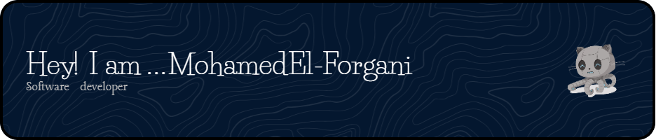

<h1 align="center">Hi 👋! My name is Mohamed El-Forgani and I'm a Software Developer.</h1>

###

  
  

###

  
  
  
  
  
  
  
  
  
  
  
  
  
  
  
  
  
  
  

###

  
  
  

###

###

 

###
